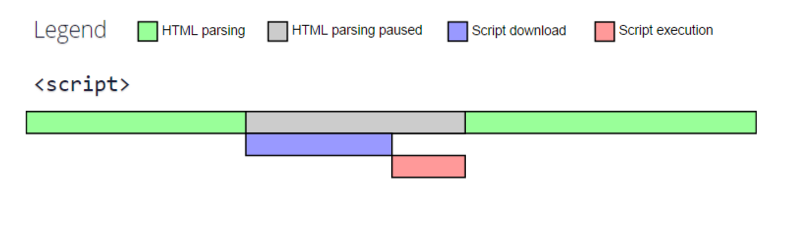
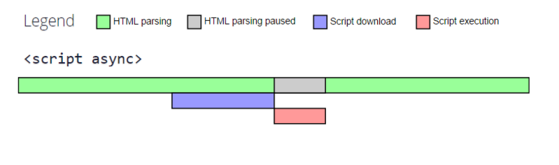
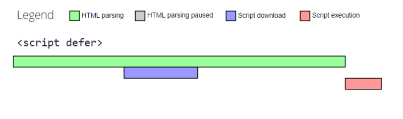

### 在 HTML 中使用 JavaScript

#### <script> src 属性

> src可以指定 **任何域** 的js，不受同源策略的影响

<br>

#### <script> 元素的加载顺序

##### 一般的加载方式：在html中遇到\<script\>，

* 依照 script 在代码中的先后顺序，依次加载、执行、加载 ......；
* 加载script代码时，停止html的解析与渲染（css动画渲染、图片下载与渲染等不受影响）；
* 执行script代码时，停止页面的所有执行行为，页面短暂卡死；

完成之后，页面恢复正常，再进行html的解析与渲染；

```html
    <script type="text/javascript" src="js/main.js"></script>
```



<br>

##### async：在html中遇到\<script\>，

* 执行无顺序可言，先加载完先执行；
* 加载script代码时，页面不受任何影响；
* 执行script代码时，停止页面的所有执行行为，页面短暂卡死；

完成之后，页面恢复正常，再进行html的解析与渲染；

```html
    <script type="text/javascript" src="js/main.js" async></script>
```



<br>

##### defer：在html中遇到\<script\>，

* 执行依照 script 在代码中的先后顺序，依次执行；
* 加载script代码时，页面不受任何影响；
* 执行script代码时，是在html渲染完毕之后，DOMContentLoaded事件触发之前，停止页面的所有执行行为，页面短暂卡死；

```html
    <script type="text/javascript" src="js/main.js" defer></script>
```



<br>

#### \<noscript\>

> 在不支持javascript脚本的情况下，会执行\<noscript\>里的代码，否则浏览器会忽视\<noscript\>

```html
    <!-- 当不支持javascript脚本时，会执行<noscript>里的代码，跳转到相应的页面 -->
    <noscript>
        <meta http-equiv=refresh content="0; url=http://www.baidu.com/baidu.html?from=noscript">
    </noscript>
```
