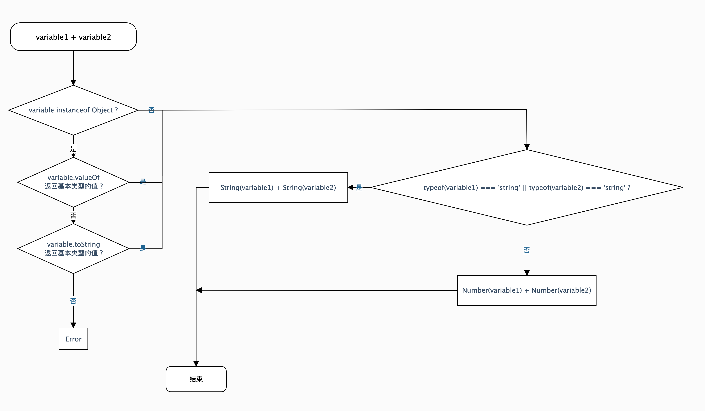

- 加法操作符的运算规则
    - 没有操作数的类型是Object类型的情况：
        - 有操作数类型是String类型的情况：
            - 如果另一个操作数类型也是String类型，返回字符串拼接的结果
            - 如果另一个操作数类型不是String类型，将另一个操作数通过String()方法转换为String类型的数据，返回字符串拼接的结果
        - 操作数类型都不是String类型的情况：操作数类型不是Number类型的，通过Number类型转换为Number类型的数据，返回加法运算结果
        - 加法规则：
            - 任意数值 (除 Infinity 、 -Infinity 、 NaN外) 相加，根据数学运算规则，返回相应的运算结果
            - Infinity 加 Infinity，返回Infinity
            - -Infinity 加 -Infinity，返回-Infinity
            - +0 加 +0，返回+0
            - +0 加 -0，返回+0
            - -0 加 -0，返回-0
            - 其余数值运算返回NaN
    - 有操作数的类型是Object类型的情况：
        - 除非明确地使用Object类型操作数的valueOf()方法或toString()方法，否则不要使用加法操作符处理对象
        - 明确地使用Object类型操作数的valueOf()方法或toString()方法之后，按照上面的 ***字符串*** 或 ***数值*** 的加法方法进行加法操作

```javascript
    // 没有操作数的类型是Object类型的情况 - 有操作数类型是String类型的情况：
    'abc' + 'd'; // 'abcd'
    'abc' + null; // 'abcnull'，String(null) -> null

    // 没有操作数的类型是Object类型的情况 - 操作数类型都不是String类型的情况：
    true + true; // 2，Number(true) -> 1

    // 没有操作数的类型是Object类型的情况 - 加法规则：
    1 + 2; // 3
    Infinity + Infinity; // Infinity
    -Infinity + Infinity; // NaN
    -Infinity + -Infinity; // Infinity
    +0 + +0; // +0
    +0 + -0; // +0
    -0 + -0; // -0
    NaN + 1; // NaN

    // 有操作数的类型是Object类型的情况 - 没有明确地使用Object类型操作数的valueOf()方法或toString()方法：
    // 就因为操作符的位置不同，导致返回的结果不同
    {} + 1; // 1
    1 + {}; // '1[object Object]'

    // 有操作数的类型是Object类型的情况 - 明确地使用Object类型操作数的valueOf()方法或toString()方法：
    var obj = {valueOf: () => 123};
    +obj + 1; // 124，+obj -> Number(obj) -> obj.valueOf() -> 123
    1 + +obj; // 124，+obj -> Number(obj) -> obj.valueOf() -> 123
```


