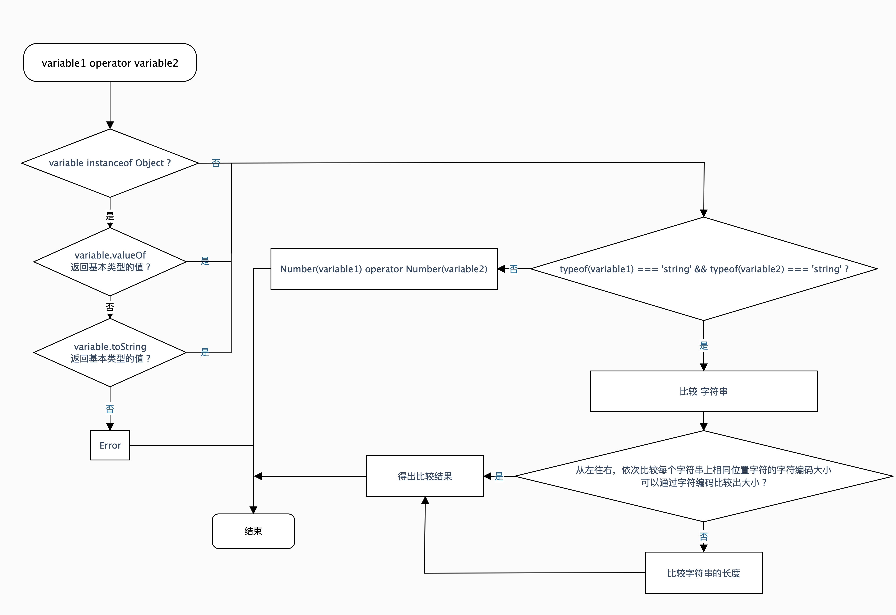

 - 关系操作符的运算规则
    - 没有操作数的类型是Object类型的情况：
        - 如果两个操作数是字符串
            - 从字符串的第一个字符开始依次比较字符编码大小，如果可以通过字符编码比较出大小，则返回结果；否则进入下面的比较
            - 如果通过字符编码无法比较大小，则通过字符串的长度来比较大小
        - 其他情况，如果操作数类型不是Number类型的，先通过Number()方法转换为Number类型的数据，然后再进行大小比较
    - 有操作数的类型是Object类型的情况：
        - 除非明确地使用Object类型操作数的valueOf()方法或toString()方法，否则不要使用关系操作符处理对象
        - 明确地使用Object类型操作数的valueOf()方法或toString()方法之后，按照上面的 ***字符串*** 或 ***数值*** 的比较方法进行大小比较
    - NaN：NaN和任何类型的数据比较大小时，返回的都是false
```javascript
    // 纯字符串比较
    'abc' < 'b'; // true，'abc'.charCodeAt(0) -> 97，'b'.charCodeAt(0) -> 98
    'abc' < 'abcd'; // true，通过字符编码无法比较出大小，只能通过字符串长度来比较，'abc'.length -> 3，'abcd'.length -> 4

    // 数值比较
    10 > true; // true，Number(true) -> 1
    true > null; // true，Number(true) -> 1，Number(null) -> 0

    // 对象比较
    +{valueOf: () => 1} < +{valueOf: () => 2}; // true，+{valueOf: () => 1} -> 1，+{valueOf: () => 2} -> 2

    // NaN
    NaN > 1; // false
    NaN < 1; // false
    NaN == 1; // false
```


