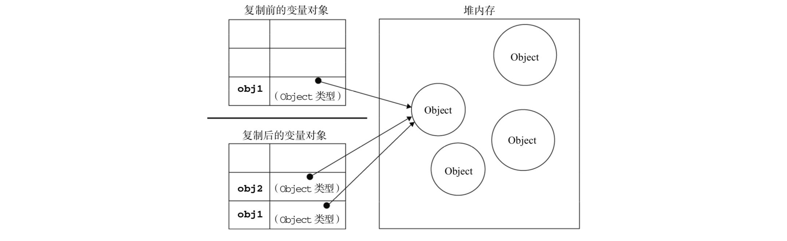

### 基本类型和引用类型的值

- 基本类型
    - 值：Undefined、Null、Boolean、Number、String
    - 基本类型的值，操作实际的值
- 引用类型
    - 值：各种对象
    - 引用类型的值，复制时，操作的是对象的引用；为对象添加属性时，操作的是对象本身

<br>

#### 动态的属性

- 基本类型的值，无法为其添加属性
```javascript
    var name = 'Mike';
    name.type = 'English';
    console.log(name.type); // undefined，无法给基础类型的值添加属性
```
- 引用类型的值，可以为其添加属性
```javascript
    var person = {};
    person.name = 'Mike';
    console.log(person.name); // 'Mike'，可以给引用类型的值添加属性
```

<br>

#### 复制变量值

- 基本类型值的复制：值复制为新值，新值赋值给新变量
```javascript
    var num1 = 5;
    var num2 = num1;

    num1; // 5
    num2; // 5

    num1 = 0;

    num1; // 0
    num2; // 5，num1、num2两个值之间没有任何关联
```


- 引用类型值的复制：把值的引用赋值给新变量
```javascript
    var person1 = {};
    person2 = person1;

    person1.name = 'Mike'; // 给对象添加属性，操作的是对象本身
    console.log(person2.name); // 'Mike'，person1、person2都指向同一个引用
```



<br>

#### 传递参数

- 函数参数都是按值传递的：
    - 1. 基本类型值的传递，如同基本类型变量复制一样；
    - 2. 引用类型值的传递，如同引用类型变量复制一样；
- 参数可以理解在函数内部声明了局部变量；传参，如同函数外部的值，复制给函数内部的这些局部变量
```javascript
    var num = 1;

    function add10(n) {
        return n += 10;
    }

    add10(num); // 11;
    console.log(num); // 10，函数内部 n + 10，基本类型值的复制，是完全的复制，不会影响到num值的变化


    var person = {};

    function setName(p1) {
        p1.name = 'Mike';
    }

    setName(person);
    console.log(person.name); // 'Mike'，引用类型值的复制，按引用复制，实际操作的还是同一个对象


    var person = {};

    function setName(p1) {
        p1.name = 'Mike';
        p1 = {};
        p1.name = 'John';
    }

    setName(person);
    console.log(person.name); // 'Mike'，引用类型值的复制，按引用复制，当p1 = {};时，失去了之前对象的引用，操作的是新对象

```

<br>

#### 检测类型

- typeof操作符 无法检测各个对象的具体类型

- instanceof 可以检测 `某个对象` 是否为 `某个类型的对象`

```javascript
    result = variable instanceof constructor
```
- `variable` 为基础类型值的时候，`result` 为false
- `constructor` 必须为 `构造函数`，否则会 `报错`

```javascript

    1 instanceof Object; // false，基础类型值，始终返回false

    new Date() instanceof Object; // true，所有引用类型值的构造函数都是Object
    ({}) instanceof Object; // true，所有引用类型值的构造函数都是Object
    [] instanceof Object; // true，所有引用类型值的构造函数都是Object
    (() => {}) instanceof Object; // true，所有引用类型值的构造函数都是Object

    new Date() instanceof Date; // true，各类对象的构造函数，都是各自的构造函数
    ({}) instanceof Object; // true，各类对象的构造函数，都是各自的构造函数
    [] instanceof Array; // true，各类对象的构造函数，都是各自的构造函数
    (() => {}) instanceof Function; // true，各类对象的构造函数，都是各自的构造函数

```
