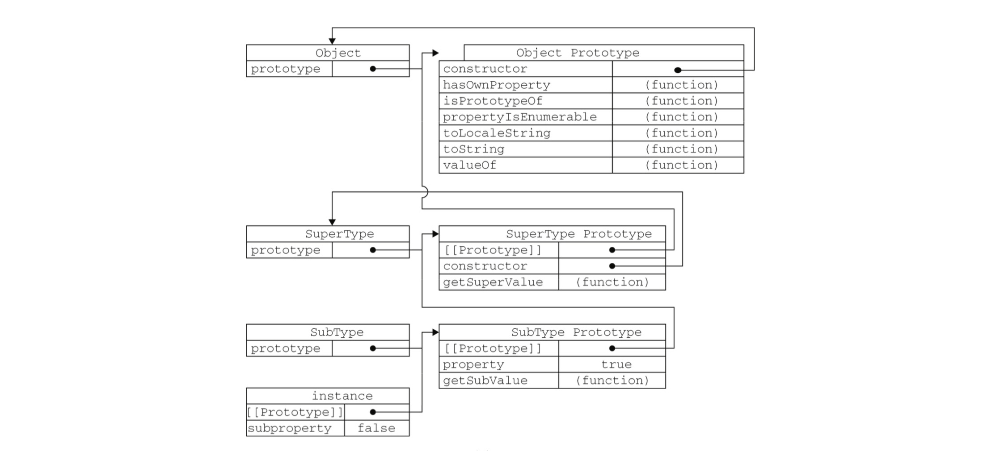

### 继承

- 原型链

> 原型链
- 实例对象包含一个指向原型对象的内部指针
- `引用类型`，默认都 `继承了Object的实例`
- 确定原型和实例之间的关系
    - instanceof 操作符
    - isPrototypeOf( ) 方法
```javascript

    function SuperType() {
        this.property = true;
        this.list = ['one', 'two'];
    }

    SuperType.prototype.getSuperValue = function() {
        return ths.property;
    }

    function SubType() {
        this.subproperty = true;
    }

    SubType.prototype = new SuperType();

    var instance = new SubType();

    instance instanceof SubType;   // true
    instance instanceof SuperType; // true
    instance instanceof Object;    // true   实例对象继承了Object实例

    var instance1 = new SubType();
    var instance2 = new SubType();

    instance1.list.push('three');

    instance1.list; // ['one', 'two', 'three']
    instance2.list; // ['one', 'two', 'three'].   原型对象上的引用类型值，无法私有化

```

- 缺点：
    - 原型对象的 `引用类型值`，不能 `私有化`，`容易造成相互干扰`
    - 无法在不影响所有实例对象的同时给 `超类型的构造函数传递参数`

<br>

> Object.create( ) 方法

- `原型链继承`
- `对象的浅复制`
- `Object.create(obj[, propertiesObject])`
```javascript

    function objectCreate(o, propertiesObject) {
        function F() {}

        F.prototype = o;

        var instace = new F();

        Object.defineProperties(instace, propertiesObject);

        return instance;
    }

```
```javascript


    var person = {
        name: 'Nicholas',
        friends: ['Shelby', 'Court', 'Van']
    };

    var anotherPerson = Object.create(person, {
        name: {
            value: 'Greg'
        }
    });

    anotherPerson.name; // 'Greg'

```

<br>

> 寄生组合式继承

- 在构造函数内，调用超类构造函数
- 在原型上，赋值给超类的原型

```javascript

    function SuperType(name){
        this.name = name;
        this.colors = ['red', 'blue', 'green'];
    }

    SuperType.prototype.sayName = function() {
        console.log(this.name);
    };

    function SubType(name, age) {
        SuperType.call(this, name);

        this.age = age;
    }

    SubType.prototype = SuperType.prototype;

    // 指回正确的构造函数
    SubType.construcor = SubType;

    SubType.prototype.sayAge = function() {
        console.log(this.age);
    };


    // ------------------ 原型对象上 继承 实例属性 ------------------

    function SuperType(name){
        this.name = name;
        this.colors = ['red', 'blue', 'green'];
    }

    SuperType.prototype.sayName = function() {
        console.log(this.name);
    };


    // 临时桥接的构造函数
    function F() {
        SuperType.apply(this, arguments);
    }


    function SubType(name, age) {
        this.age = age;
    }

    SubType.prototype = new F('Mike');

    // 指回正确的构造函数
    SubType.construcor = SubType;

    SubType.prototype.sayAge = function() {
        console.log(this.age);
    };

    var instace = new SubType();

    instace.name; // 'Mike'
    instace.colors; // ['red', 'blue', 'green']

```
