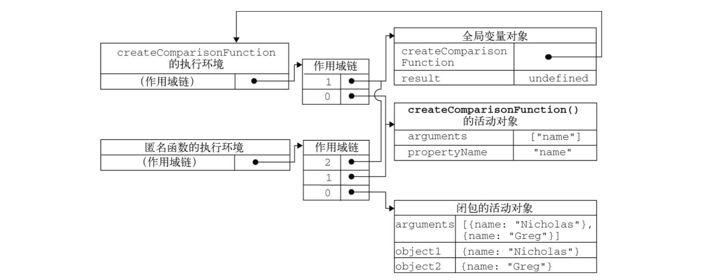

### 递归

- `递归函数` 是 `在一个函数内部` 通过名字 `调用自身` 的情况下构成的
- `严格模式` `禁止访问arguments.callee`，可以使用 `命名函数表达式` 来达成相同效果

```javascript

    // 递归函数
    var factorial = (function f(num) {
        if (num <= 1) {
            return 1;
        } else {
            return num * f(num - 1);
        }
    });

```

<br>

> 闭包

- 闭包：`有权访问` `另一个函数作用域中的变量` 的 `函数`
- 函数执行环境
    - 作用域链
        - 1. 函数的活动对象
        - 2. 外部函数的活动对象
        - 3. ......
        - 4. 全局环境
- `函数创建`时，`创建了函数的作用域链`

```javascript

    function createComparisonFunction(propertyName) {
        return function(object1, object2) {
            switch(true) {
                case object1[propertyName] < object2[propertyName]:
                    return -1;
                case object1[propertyName] > object2[propertyName]:
                    return 1;
                default:
                    return 0;
            }
        }
    }

    var compareNames = createComparisonFunction('name');

    var result = compareNames({name: 'Nicholas'}, {name: 'Greg'});

    compareNames = null; // compareNames不使用了，解除全局函数的引用，释放内存

```



<br>

> 模仿块级作用域

- `立即执行` 的 `匿名函数`
- 限制向全局环境中添加不必要的变量和函数，`减少全局环境中命名冲突的问题`


